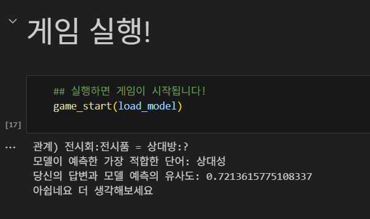
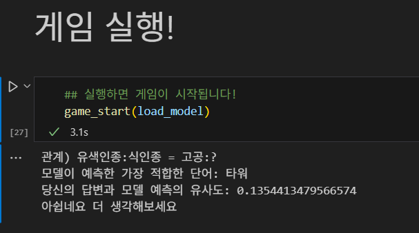

# 훈이의 유사 단어 찾기 게임에 오신 강사님을 환영합니다💕

## 데이터 출처
https://github.com/kakaobrain/kor-nlu-datasets/tree/master

 

## 대응 기준
- 대척점:  `most_similar()`에서 음(negative) 방향으로 가장 큰 것

 

## 실행 결과 화면
<결과 1>

<결과 2>

